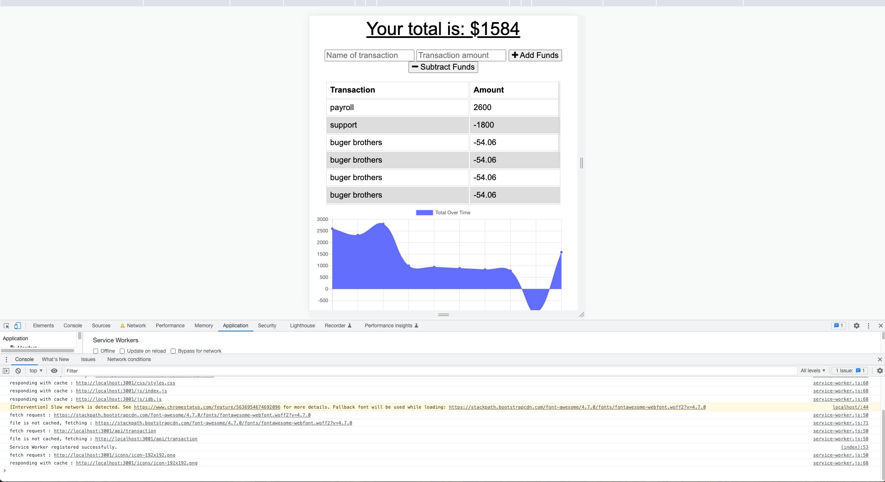
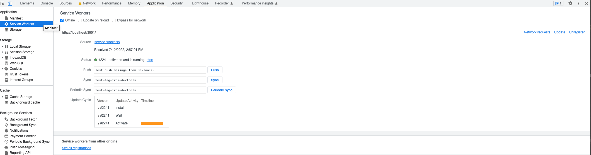

# Budget_trackeer

<h1 align="center">Budget Tracker</h1>

# description:
This application allows the user to create transactions for their budget online and offline and download a PWA.

1. User will be able to input an expense or deposit whether they are online or offline.
2. When the user reestablishes an internet connection a notification is sent saying that all transactions have been updated.

* Deployed Application https://evening-peak-68476.herokuapp.com/

# Table of Content
  - [descriptions](#description)
  - [username](#username)
  - [github](#github)
  - [Contributions](#contributions)
  - [email](#email)
  - [license](#license)
  - [Installation](#installation)
  - [Usage](#usage)
  - [Issues](#issues)
  - [Links](#links)

## username:
https://github.com/cspower5

## github
content_management_systems

## Contributions
Christopher Borer

## email
chris.borer@gmail.com

## license
  MIT 
  (https://opensource.org/licenses/MIT)
## Installation
- Navigate to 
- Click the 'code' button and download the zip file.
- Unzip the file on your computer.
## Usage
   Once you've downloaded the code open the zipped folder in an IDE.

Then run 'npm install' and you will need to create your own .env file to hook it up to your MongoDB. Once that is done you can run 'npm start' to start the application.

## Issues
  contact contributors
## Links
    screen shot video
* Video Screen shot: https://drive.google.com/file/d/1rgT9XslKckIsbHJ-J20H1Nqlwulo_UTl/view
    
 git hub
* GitHub: https://github.com/cspower5/content_management_systems
* GitHub: https://cspower5.github.io/content_management_systems/